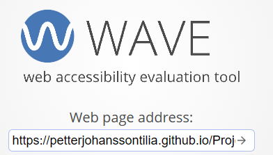

  

<h1>Angry neighbors</h1>
This is a HTML/CSS only portfolio-project.  
The website is designed to be a hub for people that likes to complain about their neighbors. The website offers satirical articles and it also allows for users to upload their own photos and share their real world neighbor stories. The goal is to make the website fun. You'll either laugh at the satire articles or laugh/symphatise with other people that don't have the best of neighbors.  

The design is stylized in a cartoonish way to emphasize the light-heartedness of the website and to prevent it from becoming a place meant to promote actual hate of your neighbors.

## Table of Contents

1.  

        
<a href="#ux">UX</a>

        <ul>
        <li>

        
<a href="#goals">Goals</a>

        - [Visitor Goals](#visitor-goals)
        - [Business Goals](#business-goals)
        - [User Stories](#user-stories)
        
</li>

        <li>

        
<a href="#visual-design">Visual Design</a>

        - [Wireframes](#wireframes)
        - [Fonts](#fonts)
        - [Icons](#icons)
        - [Colors](#colors)
        - [Images](#images)
        - [Styling](#styling)
        
</li>
        </ul>

    

2.  

        
<a href="#features">Features</a>

        <ul>
        <li>

        
<a href="#page-elements">Page Elements</a>

        - [All Pages](#all-pages)
        - [Index Page](#index-page)
        - [Gallery Page](#gallery-page)
        - [Contact Page](#contact-page)
        
</li>

        <li>

        
<a href="#additional-features">Additional Features</a>

        - [Image Loading Blur](#image-loading-blur)
        - [Email](#email)
        
</li>

        <li>

        
<a href="#feature-ideas">Feature Ideas</a>

        - [Basic](#basic)
        - [Content](#content)
        
</li>
        </ul>

    

3.  

        
<a href="#technologies-used">Technologies Used</a>

        - [Languages](#languages)
        - [Frameworks](#frameworks)
        - [Libraries](#libraries)
        - [APIs](#apis)
        - [Platforms](#platforms)
        - [Other Tools](#other-tools)

    

4.  

        
<a href="#testing">Testing</a>

        <ul>
        <li>

        
<a href="#methods">Methods</a>

        - [Validation](#validation)
        - [General Testing](#general-testing)
        - [Mobile Testing](#mobile-testing)
        - [Desktop Testing](#desktop-testing)
        
</li>

        <li>

        
<a href="#bugs">Bugs</a>

        - [Known Bugs](#known-bugs)
        - [Fixed Bugs](#fixed-bugs)
        
</li>
        </ul>

    

5.  

        
<a href="#deployment">Deployment</a>

        <ul>
        <li>

        
<a href="#local-deployment">Local Deployment</a>

        - [Local Preparation](#local-preparation)
        - [Local Instructions](#local-instructions)
        
</li>

        <li>

        
<a href="#github-deployment">Github Deployment</a>

        - [Github Preparation](#github-preparation)
        - [Github Instructions](#github-instructions)
        
</li>
        </ul>

    

6.  

        
<a href="#credit-and-contact">Credit and Contact</a>

        
        - [Content](#content)
        - [Contact](#contact)
    

---

# UX

## Goals

### Visitor Goals

The target audience for Angry Neighors are:

- People who want read satire articles.
- People who want to laugh at other peoples stories and photos
- People that want to share their own stories and photos.

User goals are:

- View and submit photos.
- Read and submit stories.
- Read the articles.

Angry Neighbors fills these needs by:

- Putting the articles and a big colorful hero-picture on the front page, capturing the users interest
- Letting the users navigate easily through the site.
- making the site very simple with little distractions.
- Putting all the gallary images in a collage letting the user feel like they're the ones finding the new fun photos
- Putting a big "submit your own story" button on the story page, encouraging members to contribute with even more content

### User Stories

1. As a user interested in laughing at other peoples missery, I expect to see real world stories.
2. As a user I'd like to be able to share my own stories.
3. If I were interested in submiting a story, I expect to know where.
4. I would like to view the gallery images on any device.
5. I expect to be able to follow Angry neighbors through social media.

## Visual Design

### Wireframes

Wireframes: <a href="./assets/readme/wireframes/Wireframes.pdf">Wireframes</a>

### Fonts

  

- The primary font, [Pridi](https://fonts.google.com/specimen/Pridi?query=pridi) was chosen because it is big, bold and a bit cartoonish. It looks friendly and playful. It is also sans-serif, making it very easily readable throughout different color schemes.
- The secondary font, [Pontano](https://fonts.google.com/specimen/Pontano+Sans?query=pontano) was chosen because it is thin, and plain. As a font, it gave me the impression of writing in word or a type writer. That is why it was chosen as the font for the user stories. Creating a stark contrast from what is satire and what is real user stories.

### Icons

  

- Icons are taken from the [Fontawesome](https://fontawesome.com/) Icon library and are utilised as classes in the `<i>` tag.
- As they are utilised as classes, they can easily be styled using other classes or IDs in the same tag.
- Icons are utilised in the footer for social account icons.

### Colors

  

- I wanted the site to look friendly, cartoonish and light hearted.
- The primary color used is the deep blue. This is used to create a stark contrast with the colors of the other elements on the page, drawing the eyes and focus on them.
- One accent color was chosen, the dark yellow, to give a feeling of "warning", reminiscing of a stop signal to showcase that this is a site of satirical complaints.
- Text is primarily written in white to contrast on the bold color backgrounds of the primary and accent colors.

### Images

  

- A gallery page to display all the images
- For people to feel more engaged the pictures are presented as a collage allowing the users to "find" new and fun picture.
- By having them displayed as a collage while also allowing users to upload photos by sending in an email the user won't be able to see all the photos and therefor encourages the user to visit the site often to not miss anything.

### Styling

- For this project I used flexbox to make it more responsive and for it's ease of use. Instead of tables, grids and floats.
- I used a has function for the "anger scale" buttons to indicate they've been selected.

---

# Features

## Page Elements

### All Pages

#### Navbar

  
  
  
  

- The Navbar is simple, providing four options.
- The Logo is always highlighted, swapping position as necessary depending on device size.
- On smaller devices, the menu becomes collapsible.
- The mobile nav button has been placed to the right for ease of use with one hand.
- The navbar is fixed so it is visible no matter how far you scroll.

#### Footer

  

- Located at the bottom of every page, only highlighting social sites.
- Changing shape for larger or smaller devices.

### Index Page

#### Jumbotron Image

- Picture taken from pixabay <a href="https://pixabay.com/">Pixabay</a>.
- Used as a splash image that highlights a cartoonish neighborhood at night.
  The cartoonish style helps convey that this sites articles are satirical
- An image with a mountain in the middle that stays in the center of the screen on all devices.

### Submit stories and photos

- Engage the users and make the community more alive by encouraging user submited content
- Displayed front and center on the page the user is interested in

---

# Technologies Used

## Languages

- [HTML](w3.org/standards/webdesign/htmlcss)
  - Page markup.
- [CSS](w3.org/standards/webdesign/htmlcss)
  - Styling.

## Libraries

- [Google Fonts](https://fonts.google.com)
  - Font Styles.
- [Fontawesome](https://fontawesome.com/)
  - Used for icons

## Platforms

- [Github](https://github.com/)
  - Storing code remotely and deployment.
- [Gitpod](https://gitpod.io/)
  - IDE for project development.

## Other Tools

- [Figma](https://figma.com/)
  - To create wireframes.
- [Favicon Generator](https://www.favicon-generator.org/)
  - Favicons
- [Colorhunt](https://colorhunt.co/)
  - Creating color pallettes.

---

# Testing

## Methods

### Validation

HTML has been validated with [W3C HTML5 Validator](https://validator.w3.org/).

|          |                                 Index                                 |                                                                 Gallery |                                                                 Stories |                                                                Submit stories |
| -------- | :-------------------------------------------------------------------: | ----------------------------------------------------------------------: | ----------------------------------------------------------------------: | ----------------------------------------------------------------------------: | --- |
|          |  |  |  |  | pic |
| Warnings |                                 None                                  |                                                                    None |                                                  Section lacks heading. |                                                                          None |
| Bugs     |                                 None                                  |                                                                    None |                                                                    None |                                                                          None |
| Alerts   |                                 None                                  |                                                                    None |                                                                    None |                                                                          None |
| Errors   |                                 None                                  |                                                                    None |                                                                    None |                                                                          None |

HTML has been validated with [Wave.webaim HTML5 Validator](https://wave.webaim.org/).

|          |                                 Index                                 |                                                                 Gallery |                                                                 Stories |                                                                Submit stories |
| -------- | :-------------------------------------------------------------------: | ----------------------------------------------------------------------: | ----------------------------------------------------------------------: | ----------------------------------------------------------------------------: | --- |
|          |  |  |  |  | pic |
| Warnings |                                 None                                  |                                                                    None |                                                                    None |                                                                          None |
| Bugs     |                                 None                                  |                                                                    None |                                                                    None |                                                                          None |
| Alerts   |                   Adjacent links go to the same URL                   |                                       Adjacent links go to the same URL |                                       Adjacent links go to the same URL |                                             Adjacent links go to the same URL |
| Errors   |       A form label is present, but does not contain any content       |               A form label is present, but does not contain any content |               A form label is present, but does not contain any content |                     A form label is present, but does not contain any content |

The alerts are because you can click the link to get to the page that you're currently on 
The form label not containing content is a known bug that you can find under <a href="#bugs">Bugs</a>  

Website speed optimisation has been checked with [PageSpeed Insights](https://pagespeed.web.dev/).

|               |                                 Index                                 |                                                                 Gallery |                                                                 Stories |                                                                Submit stories |
| ------------- | :-------------------------------------------------------------------: | ----------------------------------------------------------------------: | ----------------------------------------------------------------------: | ----------------------------------------------------------------------------: | --- |
|               |  |  |  |  | pic |
| Mobile        |           |          |           |           |
| Desktop       |          |           |          |          |
| Biggest issue |                 Images size and format not optimised                  |                                    Images size and format not optimised |                                    Images size and format not optimised |                                                                          None |

CSS has been validated with [W3C CSS Validator](https://jigsaw.w3.org/css-validator/)

Results are no errors found

and auto-prefixed with [CSS Autoprefixer](https://autoprefixer.github.io/).

Links checked with [W3C Link Checker](https://validator.w3.org/checklink).

All links and anchors are working. The link checker couldn't check Facebook and Twitter/X due to robots exlusion rules and therefore had to be manually tested.

### General Testing

- Each time a feature was added, all the functions were tested to see if there was an impact.
- The site was sent to friends for feedback and testing.
- All forms have validation and will not submit without the proper information.
- .gitignore file has been included to prevent system file commits.
- External links open in a new tab.

### Manual Testing

- Checked the links to Twitter and Facebook in the footer.

### Mobile Testing

- I tested the site personally on my Android device, going through the entire process, checking buttons, functions, checking out, etc. I was personally unable to test on iOS.
- The site was sent to friends and relatives for them to follow the same process. They have tested on their devices, including iOS.
- Chrome was utilised to inspect the site in mobile format, going through the pages and functions.

### Desktop Testing

- the majority of testing occurred on Chrome and Edge.
- The site was tested by friends and relatives on numerous desktop devices.
- Internet Explorer was not tested and the site was not developed with it .in mind as support for the browser is gradually being dropped.

### Testing User Stories

1. As a user interested in laughing at other peoples missery, I expect to see real world stories.

In the stories page you can find user submited stories 

0. As a user I'd like to be able to share my own stories.

In the submit stories page you can easily submit your own stories

0. If I were interested in submiting a story, I expect to know where.

You'll easily find the Submit story page by either looking at the navbar or while reading stories in the story page.

0. I would like to view the gallery images on any device.

The pages are responsive and will turn from rows on bigger screens to columns on smaller screens. The navbar will collapse and extend on different screen sizes too as previously shown.

0. I expect to be able to follow Angry neighbors through social media.

You'll easily find the links the Angry neighbors social media in the footer on every page.

## Bugs

### Known Bugs

- Wave.webaim.org validator reports empty labels while using the Fontawesome i elements with no other text inside.
- Wave.webaim.org validator warns that navbar links are redundant: That you are be able to see a link to a page that you're currently on

### Fixed Bugs

- Post method on the form not working Issue:https://github.com/PetterJohanssonTilia/Project-1-/issues/1
- CSS validator error - https://github.com/PetterJohanssonTilia/Project-1-/issues/2
- Wrong sizing of objects through different screens
- Wrong sizing of text through different screens

---

# Deployment

## Local Deployment

### Local Preparation

**Requirements:**
-A webbrowser of your choice, Chrome being recommended

### Local Instructions

1. Download a copy of the project repository [here](https://github.com/PetterJohanssonTilia/Project-1-/archive/refs/heads/main.zip) and extract the zip file
2. Open the index.html file in your browser, This file can be dragged and droped into your browser to open it.
3. Enjoy the site!

## Github Deployment

### Github Preparation

- It is possible to copy or clone the repository to directly for deployment,
  **Requirements:**
- A free GitHub account.
- A free EmailJS account.

### Github Instructions

1. Log in to your GitHub account.
   navigate to [https://github.com/PetterJohanssonTilia/Project-1-](https://github.com/PetterJohanssonTilia/Project-1-).
1. You can set up your own repository and copy or clone it, or you fork the repository.
1. `git add`, `git commit` and `git push` to a GitHub repository, if necessary.
1. GitHub pages will update from the Main branch by default.
1. Go to the **Settings** page of the repository.
1. Scroll down to the **Github Pages** section.
1. Select the Main Branch as the source and **Confirm** the selection.
1. Wait a minute or two and it should be live for viewing.

## Credits and Contact

### Content

Nearly all text content was generated by the AI, GPT-2, at [Talk to Transformer](https://talktotransformer.com/).
\*\*(So there will be plenty of grammar or spelling errors or even a bit of nonsense, but I thought it would be a fun addition to the project)88
Any code utilised from a site is documented and credited within the code.
All photographs, authors, license rights, copyright, etc. used in this project can be found [here](https://unsplash.com/collections/8825126/used-in-horizon-photo). No credit is required from Unsplash,  
All other media used is my own.

### Contact

Please feel free to contact me at `fake.email@hotmail.com`
