<h1>What Weighs More?</h1>
This is a Javascript portfolio-project.  
The website is designed to be a relaxing game of guessing and estimating weight of objects. The website offers a clear and simple game with visuals to keep the player engaged.  

The design is cartoonish and simple to allow for the animations in the background to shine more, creating a calm and enjoyable game.

## Table of Contents

1.  

      
<a href="#ux">UX</a>

      
      

<a href="#goals">Goals</a>

    - [Visitor Goals](#visitor-goals)
    - [Business Goals](#business-goals)
    - [User Stories](#user-stories)
        

        

<a href="#visual-design">Visual Design</a>

      - [Wireframes](#wireframes)
      - [Fonts](#fonts)
      - [Icons](#icons)
      - [Colors](#colors)
      - [Images](#images)
      - [Styling](#styling)

      

    

2.  

      
<a href="#features">Features</a>

      
      

      
<a href="#page-elements">Page Elements</a>

    - [All Pages](#all-pages)
    - [Index Page](#index-page)
    - [Game Page](#gallery-page)
      

      
<a href="#feature-ideas">Feature Ideas</a>

      

3.  

      
<a href="#technologies-used">Technologies Used</a>

    - [Languages](#languages)
    - [Libraries](#libraries)
    - [Platforms](#platforms)
    - [Other Tools](#other-tools)

    

4.  

      
<a href="#testing">Testing</a>

      <ul>
      <li>

      
<a href="#methods">Methods</a>

      
      - [Validation](#validation)
      - [General Testing](#general-testing)
      - [Mobile Testing](#mobile-testing)
      - [Desktop Testing](#desktop-testing)
      
</li>
      <li>

      
<a href="#bugs">Bugs</a>

    - [Known Bugs](#known-bugs)
    - [Fixed Bugs](#fixed-bugs)
    
</li>
    </ul>
    

5.  

      
<a href="#deployment">Deployment</a>

      <ul>
      <li>

      
<a href="#local-deployment">Local Deployment</a>

      - [Local Preparation](#local-preparation)
      - [Local Instructions](#local-instructions)
      
</li>
      <li>

      
<a href="#github-deployment">Github Deployment</a>

      - [Github Preparation](#github-preparation)
      - [Github Instructions](#github-instructions)
      
</li>
      </ul>
    

6.  

      
<a href="#credit-and-contact">Credit and Contact</a>

      
      - [Content](#content)
      - [Contact](#contact)
    

---

# UX

## Goals

### Visitor Goals

The target audience for What Weighs More are:

- People who want to play a relaxing game.
- People who want to see how good they are at estimating weight.
- People who want to see their knowledge of random objects.

User goals are:

- Getting a relaxing experience.
- Learning more about weight
- Learning more about different objects

What weighs more fills these needs by:

- Clearly stating the rules of the game
- Showing the game front and center without distractions
- Not having a leaderboard, time limit or limit of attempts to not make the user stressed
- Making the website simple, allowing for a relaxing background animation
- Having many different categories of objects in the game
- Having objects of many different weight classes along with a multiplier to make it more challenging

### User Stories

1. As a user interested in relaxing games I'd like to be able to play without feeling any stress
2. As a user I'd to see many different objects
3. I'd Like to get a challenge and really test my guessing abilites

## Visual Design

### Wireframes

Index 

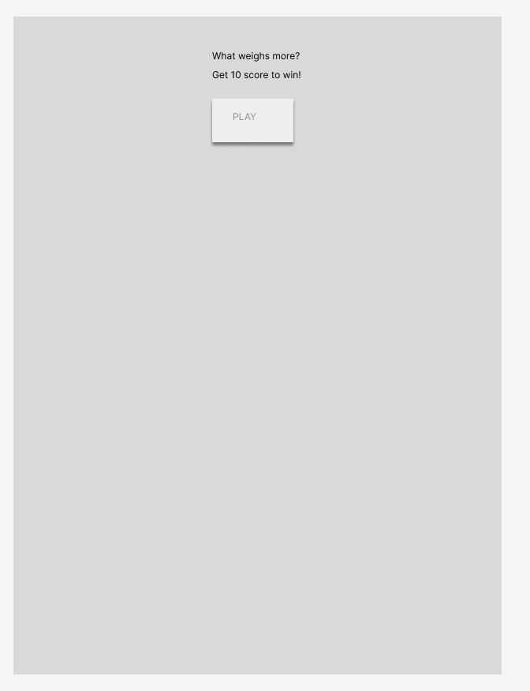
Game 

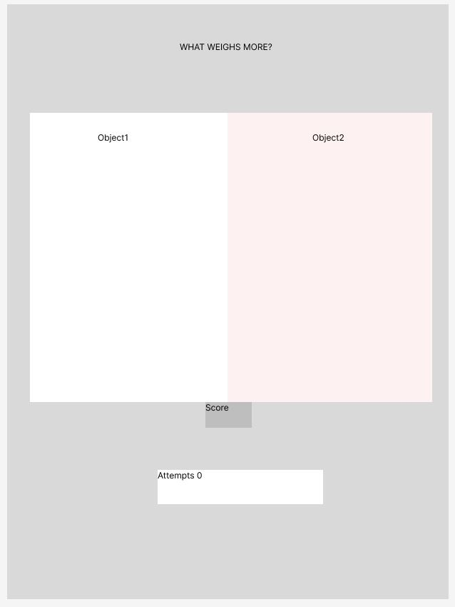

### Fonts

- The primary font, <a href="https://fonts.google.com/specimen/Barlow+Condensed?query=barlow+con">[Barlow Condensed]</a> Is used in the games boxes and is used because it's calm and simple
- The secondary font, which is actually used for the header is <a href="https://fonts.google.com/specimen/Imbue?query=imbue">Imbue</a> it looks elegant and fit very nicely with the dark background. It was chosen to contrast the other fonts making the player only read it once and then easily sort it out from the other text used in the game.

### Colors

  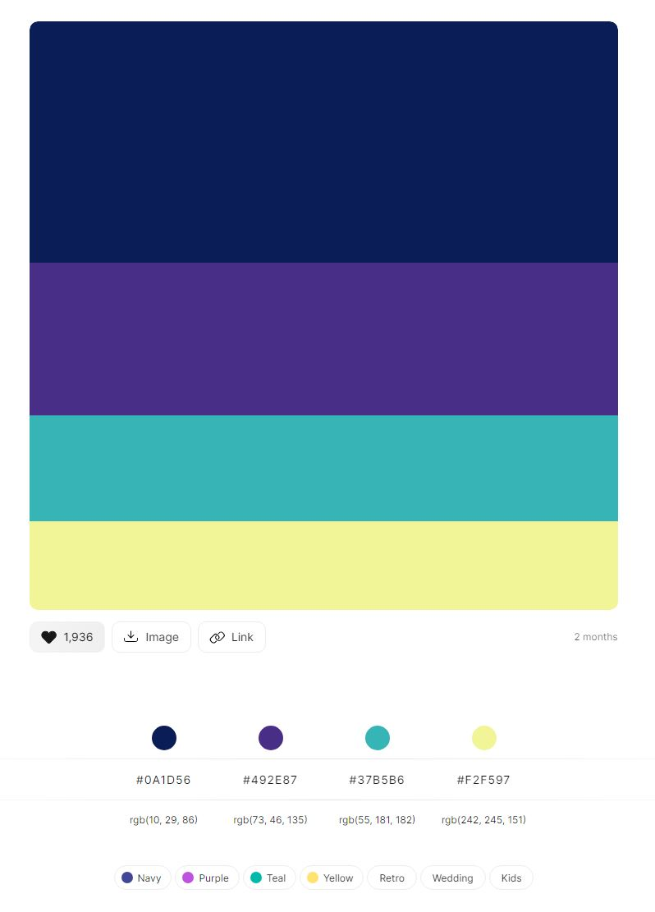

- Colors found on <a href="https://colorhunt.co/palette/0a1d56492e8737b5b6f2f597">ColorHunt</a>
- I wanted the site to look friendly, cartoonish and light hearted.
- The primary color used is the deep blue. This is used to create a stark contrast with the colors of the other elements on the page, drawing the eyes and focus on them.
- One accent color was chosen, the dark yellow, to give a feeling of "warning", reminiscing of a stop signal to showcase that this is a site of satirical complaints.
- Text is primarily written in white to contrast on the bold color backgrounds of the primary and accent colors.

### Images

  

- All the objects images are found on <a href="https://pixabay.com/">pixabay</a>
- I've chosen these pictures because they're all 2d vector graphics and match easily
- The bubble picture is drawn by me

### Styling

- For this project I used grid to more easily put all the different elements in their correct places
- I used animations to make the simple style look more interesting while playing

---

# Features

## Page Elements

### Header

At the top of all pages to display the name of the game.

### Guess-boxes

These are displayed front and center with clear borders to clearly show the objects for the game.

### Score-box

The score box is displayed under the guess-boxes.
and is animated to both jump and change color depending
if you answer correct or false.

### Attempts-box

The attempts-box is located under scorebox and displays the number of attempts you've made, each attempt is a click and this box is not animated to not bring out too many visuals.

### Play-button

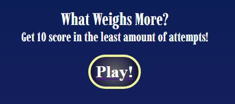
The play button is located on the front page and displayed clearly.
It has a wider gap between itself and the text than the header and the text to seperate them more clearly.

#### Footer

- Located at the bottom of every page
- Displays the author of the project
- Changing shape for larger or smaller devices.

---

# Feature-Ideas

### Player feedback

The Idea of the attempts-box, score-box and the bubbles in the background is to give the
player feedback when playing. When you guess a bubble either appears or dissapears, the attempts-box changes its score and the score-box is animated to bounce and change color to grab the users attention and indicate a right or wrong guess.

# Technologies Used

## Languages

- [HTML]
  - Page markup.
- [CSS]
  - Styling and animations
- [Java-script]
  - Interactivity

## Libraries

- [Google Fonts](https://fonts.google.com)
  - Font Styles.

## Platforms

- [Github](https://github.com/)
  - Storing code remotely and deployment.
- [Gitpod](https://gitpod.io/)
  - IDE for project development.

## Other Tools

- [Figma](https://figma.com/)
  - To create wireframes.
- [Colorhunt](https://colorhunt.co/)
  - Creating color pallettes.
- [grid.layoutfit](https://grid.layoutit.com/)
  - Create the grid layout

---

# Testing

## Methods

### Validation

HTML has been validated with [W3C HTML5 Validator](https://validator.w3.org/).

|        |                                index.html                                 |                                                                game.html |
| ------ | :-----------------------------------------------------------------------: | -----------------------------------------------------------------------: |
|        | 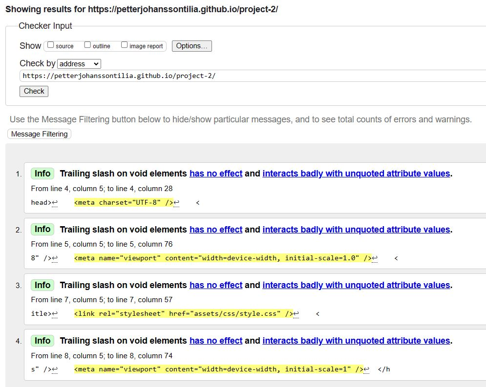 | 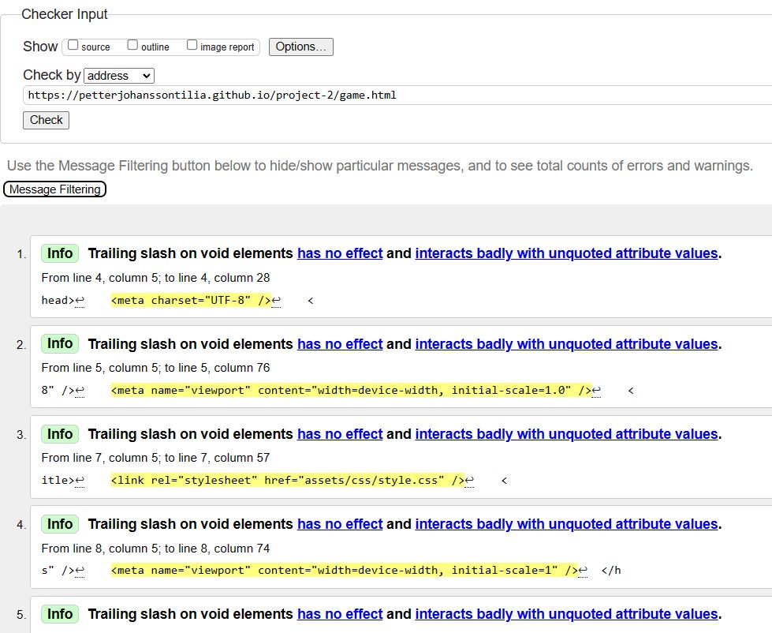 |
| Alerts |                              Trailing slash                               |                                                           Trailing slash |

"Trailing slash on void elements has no effect and interacts badly with unquoted attribute values." This is from the prettier extension to make the code more readable but it has no effect on the code

HTML has been validated with [Wave.webaim HTML5 Validator](https://wave.webaim.org/).

|        |                                  index.html                                  |                                                                   game.html |
| ------ | :--------------------------------------------------------------------------: | --------------------------------------------------------------------------: |
|        | 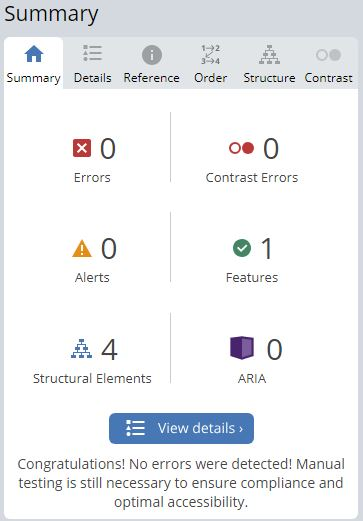 | 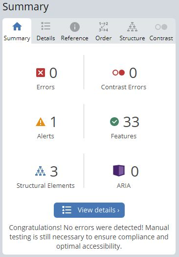 |
| Alerts |                                     None                                     |                                       A paragraph is used instead of header |

Website speed optimisation has been checked with [PageSpeed Insights](https://pagespeed.web.dev/).

|                    |                                    index.html                                    |                                                                       game.html |
| ------------------ | :------------------------------------------------------------------------------: | ------------------------------------------------------------------------------: |
|                    | 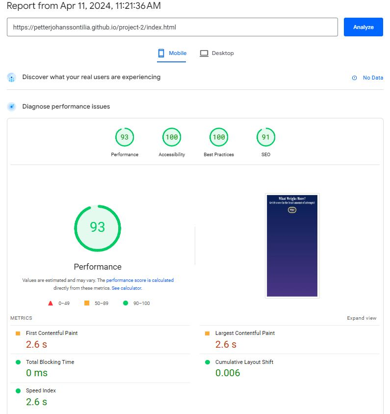 | 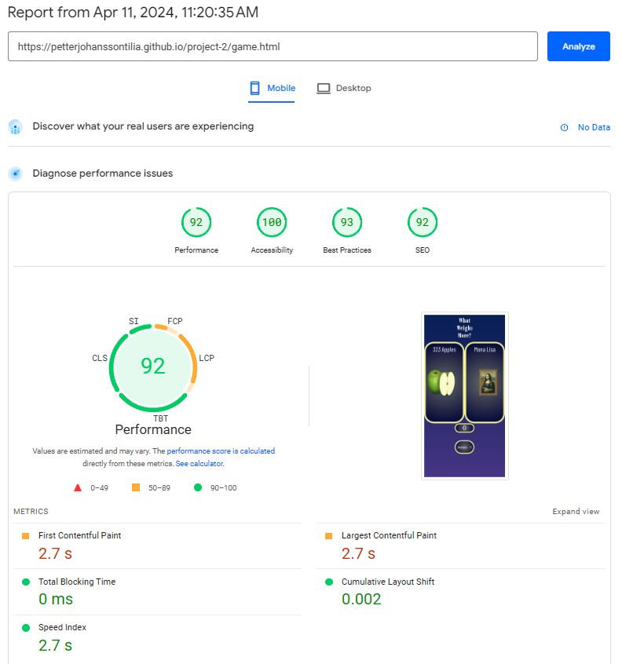 |
| Performance issues |                                       none                                       |                                                                            none |

Javascript has been checked with [JShint](https://jshint.com/).

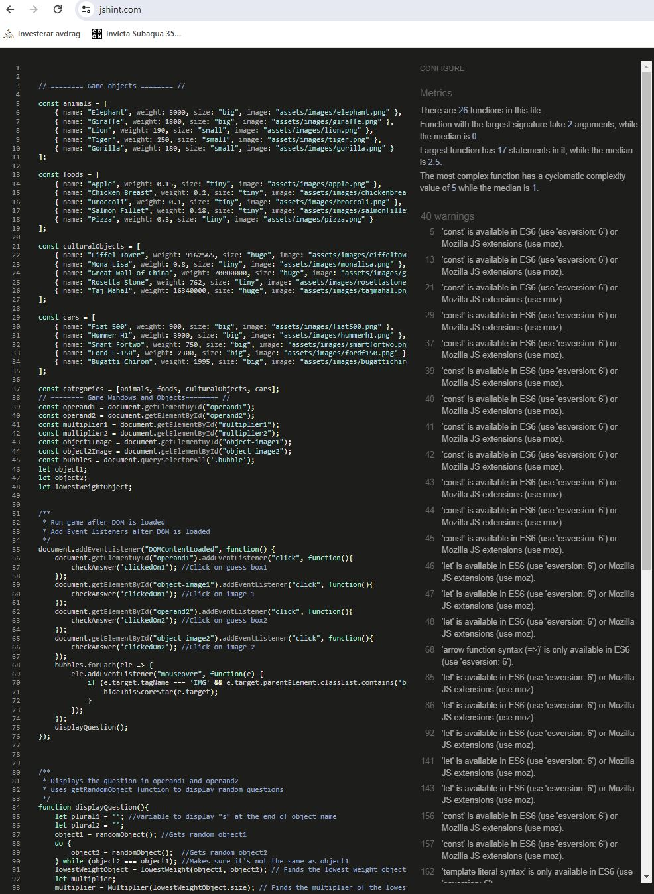

|          |                        |     |
| -------- | :--------------------: | --: |
| Warnings | Const and Let warnings |     |
| Errors   |          None          |     |

When using JSHint to check my JavaScript code, it doesn't recognize the const/let keywords, which is part of ES6 (ECMAScript 2015). This is because JSHint needs to be configured to understand ES6 syntax. Without this configuration, it may flag the use of const as an error, even though it's a valid feature in modern JavaScript.

CSS has been validated with [W3C CSS Validator](https://jigsaw.w3.org/css-validator/)

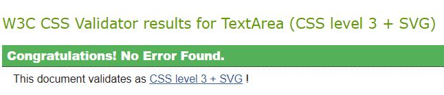
Results are no errors found

and auto-prefixed with [CSS Autoprefixer](https://autoprefixer.github.io/).

Links checked with [W3C Link Checker](https://validator.w3.org/checklink).

All links and anchors are working.

### General Testing

- Each time a feature was added, all the functions were tested to see if there was an impact.
- The site was sent to friends for feedback and testing.
- .gitignore file has been included to prevent system file commits.

### Manual Testing

- Testing done through playing the game
- Checked the links to Twitter and Facebook in the footer.

### Mobile Testing

- I tested the site personally on my Android device, going through the entire process, checking buttons, functions, checking out, etc. I was personally unable to test on iOS.
- The site was sent to friends and relatives for them to follow the same process. They have tested on their devices, including iOS.
- Chrome was utilised to inspect the site in mobile format, going through the pages and functions.

### Desktop Testing

- the majority of testing occurred on Chrome and Edge.
- The site was tested by friends and relatives on numerous desktop devices.
- Internet Explorer was not tested and the site was not developed with it .in mind as support for the browser is gradually being dropped.

### Testing User Stories

|     |                                           User story                                            |                                                                                                              Answer to user story |
| --- | :---------------------------------------------------------------------------------------------: | --------------------------------------------------------------------------------------------------------------------------------: |
| 1   | "As a user interested in relaxing games I'd like to be able to play without feeling any stress" |                                The game features no attempts limit or time limit. This makes the game more suited for casual play |
| 2   |                          "As a user I'd to see many different objects"                          | The game contains 4 categories and 5 objects in each category. Adding more objects to the game has been made easy by using arrays |
| 3   |               "I'd Like to get a challenge and really test my guessing abilites"                |                 With the random multiplier being added to the lowest weight target it makes for a much more complex guessing game |

## Bugs

### Known Bugs

- If you're at minus 1 score and you have no score-star spans active the displayQuestion function will not display a new question untill you've answered correctly
- If you have guessed correctly 30 times in a row and all score-star spans are being showned displasyQuestion will not show a new question untill you've hiden more of the spans

### Fixed Bugs

- [Readme](https://github.com/PetterJohanssonTilia/project-2/commit/53aaa8ea9d0471906e0294f3e4e879772752509c) Readme couldn't display images when they were named with uppercase .JPG and.PNG
- [UnhideScorestar](https://github.com/PetterJohanssonTilia/project-2/issues/3)
  Hiding/showing random spans instead of the already hidden/shown ones
- [Evenlistener not working](https://github.com/PetterJohanssonTilia/project-2/issues/4) Couldn't add eventlistener dynamically so instead created a new class to listen to at the start of the game
- [Multiplier Value](https://github.com/PetterJohanssonTilia/project-2/commit/85259db2acb84c6aca227400fb41c601f4dd4a47) not defined before being used

---

# Deployment

## Local Deployment

### Local Preparation

**Requirements:**
-A webbrowser of your choice, Chrome being recommended

### Local Instructions

1. Download a copy of the project repository [here](https://github.com/PetterJohanssonTilia/Project-2/archive/refs/heads/main.zip) and extract the zip file
2. Open the index.html file in your browser, This file can be dragged and droped into your browser to open it.
3. Enjoy the site!

## Github Deployment

### Github Preparation

- It is possible to copy or clone the repository to directly for deployment,
  **Requirements:**
- A free GitHub account.
- A free EmailJS account.

### Github Instructions

1. Log in to your GitHub account.
   navigate to [https://github.com/PetterJohanssonTilia/Project-1-](https://github.com/PetterJohanssonTilia/Project-1-).
1. You can set up your own repository and copy or clone it, or you fork the repository.
1. `git add`, `git commit` and `git push` to a GitHub repository, if necessary.
1. GitHub pages will update from the Main branch by default.
1. Go to the **Settings** page of the repository.
1. Scroll down to the **Github Pages** section.
1. Select the Main Branch as the source and **Confirm** the selection.
1. Wait a minute or two and it should be live for viewing.

## Credits and Contact

### Content

All the image content was from pixabay.com and all the objects and their weights was generated by chatgpt

### Contact

Please feel free to contact me at `fake.email@hotmail.com`
